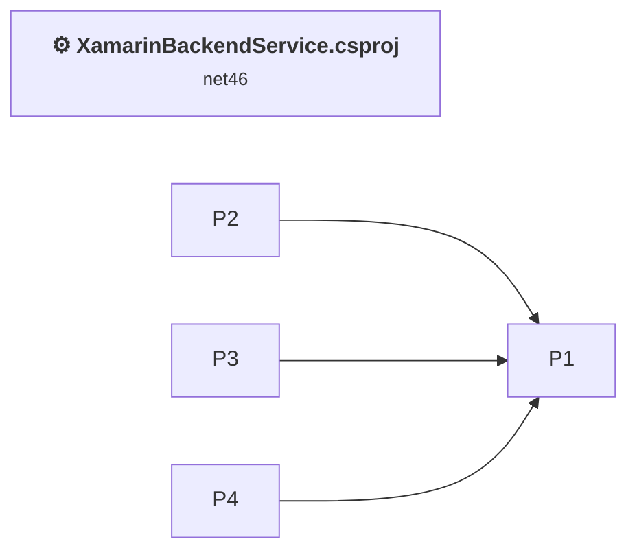
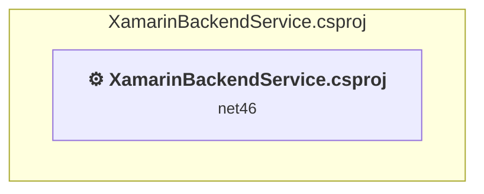

# Assessment: .NET Version Upgrade — XamarinBackendService

> Auto-generated assessment supplemented with manual analysis (solution could not be loaded via tooling due to Xamarin PCL projects).

## Project Overview

| Property | Value |
|----------|-------|
| Project | XamarinBackendService |
| Current TFM | net4.6 (ASP.NET Framework) |
| Target TFM | net10.0 (ASP.NET Core) |
| Project Type | ASP.NET Web API (OWIN/Katana) |
| Project Format | Legacy (non-SDK-style) |

## Table of Contents

- [Executive Summary](#executive-Summary)
  - [Highlevel Metrics](#highlevel-metrics)
  - [Projects Compatibility](#projects-compatibility)
  - [Package Compatibility](#package-compatibility)
  - [API Compatibility](#api-compatibility)
- [Aggregate NuGet packages details](#aggregate-nuget-packages-details)
- [Top API Migration Challenges](#top-api-migration-challenges)
  - [Technologies and Features](#technologies-and-features)
  - [Most Frequent API Issues](#most-frequent-api-issues)
- [Projects Relationship Graph](#projects-relationship-graph)
- [Project Details](#project-details)

  - [XamarinBackendService\XamarinBackendService.csproj](#xamarinbackendservicexamarinbackendservicecsproj)

## Executive Summary

### Highlevel Metrics

| Metric | Count | Status |
| :--- | :---: | :--- |
| Total Projects | 5 | All require upgrade |
| Total NuGet Packages | 23 | 21 need upgrade |
| Total Code Files | 12 |  |
| Total Code Files with Incidents | 3 |  |
| Total Lines of Code | 463 |  |
| Total Number of Issues | 34 |  |
| Estimated LOC to modify | 7+ | at least 1,5% of codebase |

### Projects Compatibility

| Project | Target Framework | Difficulty | Package Issues | API Issues | Est. LOC Impact | Description |
| :--- | :---: | :---: | :---: | :---: | :---: | :--- |
| [XamarinBackendService\XamarinBackendService.csproj](#xamarinbackendservicexamarinbackendservicecsproj) | net46 | 🔴 High | 25 | 7 | 7+ | Wap, Sdk Style = False |

### Package Compatibility

| Status | Count | Percentage |
| :--- | :---: | :---: |
| ✅ Compatible | 2 | 8,7% |
| ⚠️ Incompatible | 18 | 78,3% |
| 🔄 Upgrade Recommended | 3 | 13,0% |
| ***Total NuGet Packages*** | ***23*** | ***100%*** |

### API Compatibility

| Category | Count | Impact |
| :--- | :---: | :--- |
| 🔴 Binary Incompatible | 0 | High - Require code changes |
| 🟡 Source Incompatible | 6 | Medium - Needs re-compilation and potential conflicting API error fixing |
| 🔵 Behavioral change | 1 | Low - Behavioral changes that may require testing at runtime |
| ✅ Compatible | 264 |  |
| ***Total APIs Analyzed*** | ***271*** |  |

## Aggregate NuGet packages details

| Package | Current Version | Suggested Version | Projects | Description |
| :--- | :---: | :---: | :--- | :--- |
| AutoMapper | 5.2.0 | 16.1.1 | [XamarinBackendService.csproj](#xamarinbackendservicexamarinbackendservicecsproj) | NuGet package contains security vulnerability |
| EntityFramework | 6.1.3 | 6.5.1 | [XamarinBackendService.csproj](#xamarinbackendservicexamarinbackendservicecsproj) | NuGet package upgrade is recommended |
| Microsoft.AspNet.WebApi.Client | 5.2.3 | 6.0.0 | [XamarinBackendService.csproj](#xamarinbackendservicexamarinbackendservicecsproj) | ⚠️NuGet package is incompatible |
| Microsoft.AspNet.WebApi.Core | 5.2.3 |  | [XamarinBackendService.csproj](#xamarinbackendservicexamarinbackendservicecsproj) | ⚠️NuGet package is incompatible |
| Microsoft.AspNet.WebApi.OData | 5.7.0 |  | [XamarinBackendService.csproj](#xamarinbackendservicexamarinbackendservicecsproj) | ⚠️Replace with Microsoft.AspNetCore.OData: Register OData in Startup; adjust routing and controllers for OData v4 |
| Microsoft.AspNet.WebApi.Owin | 5.2.3 |  | [XamarinBackendService.csproj](#xamarinbackendservicexamarinbackendservicecsproj) | ⚠️NuGet package is incompatible |
| Microsoft.AspNet.WebApi.Tracing | 5.2.3 |  | [XamarinBackendService.csproj](#xamarinbackendservicexamarinbackendservicecsproj) | ⚠️NuGet package is incompatible |
| Microsoft.Azure.Mobile.Server | 2.0.0 |  | [XamarinBackendService.csproj](#xamarinbackendservicexamarinbackendservicecsproj) | ⚠️NuGet package is incompatible |
| Microsoft.Azure.Mobile.Server.Authentication | 2.0.0 |  | [XamarinBackendService.csproj](#xamarinbackendservicexamarinbackendservicecsproj) | ⚠️NuGet package is incompatible |
| Microsoft.Azure.Mobile.Server.Entity | 2.0.0 |  | [XamarinBackendService.csproj](#xamarinbackendservicexamarinbackendservicecsproj) | ⚠️NuGet package is incompatible |
| Microsoft.Azure.Mobile.Server.Home | 2.0.0 |  | [XamarinBackendService.csproj](#xamarinbackendservicexamarinbackendservicecsproj) | ⚠️NuGet package is incompatible |
| Microsoft.Azure.Mobile.Server.Quickstart | 2.0.0 |  | [XamarinBackendService.csproj](#xamarinbackendservicexamarinbackendservicecsproj) | ⚠️NuGet package is incompatible |
| Microsoft.Azure.Mobile.Server.Tables | 2.0.0 |  | [XamarinBackendService.csproj](#xamarinbackendservicexamarinbackendservicecsproj) | ⚠️NuGet package is incompatible |
| Microsoft.Data.Edm | 5.8.1 | 5.8.5 | [XamarinBackendService.csproj](#xamarinbackendservicexamarinbackendservicecsproj) | ⚠️Replace with Microsoft.OData.Edm: Use OData v4 model types; adjust EDM model builders |
| Microsoft.Data.OData | 5.8.4 |  | [XamarinBackendService.csproj](#xamarinbackendservicexamarinbackendservicecsproj) | ✅Compatible |
| Microsoft.Owin | 4.2.2 |  | [XamarinBackendService.csproj](#xamarinbackendservicexamarinbackendservicecsproj) | ⚠️NuGet package is incompatible |
| Microsoft.Owin.Host.SystemWeb | 3.0.1 |  | [XamarinBackendService.csproj](#xamarinbackendservicexamarinbackendservicecsproj) | ⚠️NuGet package is incompatible |
| Microsoft.Owin.Security | 3.0.1 |  | [XamarinBackendService.csproj](#xamarinbackendservicexamarinbackendservicecsproj) | ⚠️NuGet package is incompatible |
| Microsoft.WindowsAzure.ConfigurationManager | 3.2.3 |  | [XamarinBackendService.csproj](#xamarinbackendservicexamarinbackendservicecsproj) | ⚠️NuGet package is incompatible |
| Newtonsoft.Json | 13.0.1 | 13.0.4 | [XamarinBackendService.csproj](#xamarinbackendservicexamarinbackendservicecsproj) | NuGet package upgrade is recommended |
| Owin | 1.0 |  | [XamarinBackendService.csproj](#xamarinbackendservicexamarinbackendservicecsproj) | ⚠️NuGet package is incompatible |
| System.IdentityModel.Tokens.Jwt | 5.7.0 |  | [XamarinBackendService.csproj](#xamarinbackendservicexamarinbackendservicecsproj) | ✅Compatible |
| System.Spatial | 5.8.1 | 5.8.5 | [XamarinBackendService.csproj](#xamarinbackendservicexamarinbackendservicecsproj) | ⚠️Replace with Microsoft.Spatial: Use OData v4 spatial types; adjust namespaces for geography/geometric classes |

## Top API Migration Challenges

### Technologies and Features

| Technology | Issues | Percentage | Migration Path |
| :--- | :---: | :---: | :--- |
| Legacy Configuration System | 6 | 85,7% | Legacy XML-based configuration system (app.config/web.config) that has been replaced by a more flexible configuration model in .NET Core. The old system was rigid and XML-based. Migrate to Microsoft.Extensions.Configuration with JSON/environment variables; use System.Configuration.ConfigurationManager NuGet package as interim bridge if needed. |

### Most Frequent API Issues

| API | Count | Percentage | Category |
| :--- | :---: | :---: | :--- |
| T:System.Configuration.ConfigurationManager | 3 | 42,9% | Source Incompatible |
| P:System.Configuration.ConfigurationManager.AppSettings | 3 | 42,9% | Source Incompatible |
| T:System.Uri | 1 | 14,3% | Behavioral Change |

## Projects Relationship Graph

Legend:
📦 SDK-style project
⚙️ Classic project

## Project Details

### XamarinBackendService\XamarinBackendService.csproj

#### Project Info

- **Current Target Framework:** net46
- **Proposed Target Framework:** net10.0
- **SDK-style**: False
- **Project Kind:** Wap
- **Dependencies**: 0
- **Dependants**: 0
- **Number of Files**: 19
- **Number of Files with Incidents**: 3
- **Lines of Code**: 463
- **Estimated LOC to modify**: 7+ (at least 1,5% of the project)

#### Dependency Graph

Legend:
📦 SDK-style project
⚙️ Classic project

### API Compatibility

| Category | Count | Impact |
| :--- | :---: | :--- |
| 🔴 Binary Incompatible | 0 | High - Require code changes |
| 🟡 Source Incompatible | 6 | Medium - Needs re-compilation and potential conflicting API error fixing |
| 🔵 Behavioral change | 1 | Low - Behavioral changes that may require testing at runtime |
| ✅ Compatible | 264 |  |
| ***Total APIs Analyzed*** | ***271*** |  |

#### Project Technologies and Features

| Technology | Issues | Percentage | Migration Path |
| :--- | :---: | :---: | :--- |
| Legacy Configuration System | 6 | 85,7% | Legacy XML-based configuration system (app.config/web.config) that has been replaced by a more flexible configuration model in .NET Core. The old system was rigid and XML-based. Migrate to Microsoft.Extensions.Configuration with JSON/environment variables; use System.Configuration.ConfigurationManager NuGet package as interim bridge if needed. |

